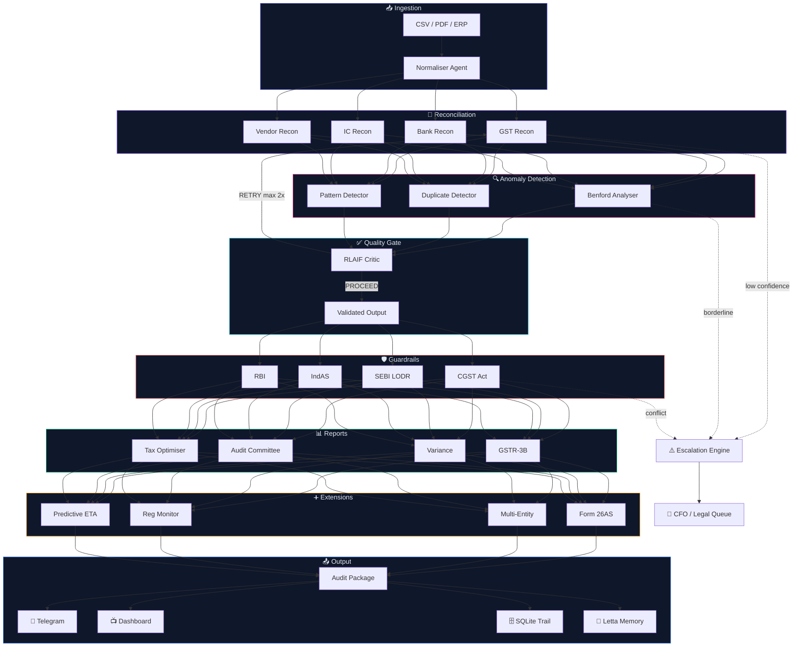

<p align="center">
  
</p>

<p align="center">
  
  
  
  
  
  
  
  
</p>

<p align="center">
  <b>15–20 days of manual quarter-close → ~4 hours. Full audit trail. Zero missed guardrails.</b>
</p>

---

## 🎯 What Is This?

FinClosePilot is a **multi-agent AI system** that automates the Indian enterprise financial close process — reconciliation, anomaly detection, regulatory compliance, and report generation — using a coordinated swarm of **12 specialised agents** orchestrated by **LangGraph**. Now featuring **Multi-User Manager-Employee workflows** and a comprehensive **14-tab audit dashboard**.

<table>
<tr>
<td width="50%">

### 🔥 The Problem
- Quarter-close takes **15–20 working days**
- **8–15 people** manually cross-check thousands of transactions
- One missed CGST §17(5) violation = **₹50L+ penalty**
- No institutional memory between close cycles

</td>
<td width="50%">

### ✅ The Solution
- **12 AI agents** running in parallel pipeline
- **Multi-Role Access**: Manager oversight for Employee-run close cycles
- Confidence-based **self-escalation** (never auto-approves uncertain items)
- **18+ hardcoded regulatory rules** with exact citations
- Persistent memory via **Letta (MemGPT)**

</td>
</tr>
</table>

---

## 🏗️ System Architecture

### Pipeline Flow



> **Communication model:** All agents share a `PipelineState` TypedDict. Parallel sub-steps use `asyncio.gather()`. No direct agent-to-agent messaging — the pipeline state is the single source of truth.

---

## 🤖 Agent Roles

| # | Agent | What It Does | Model Tier |
|:-:|-------|-------------|:----------:|
| 1 | 📥 **Normaliser** | Standardises CSV/PDF/ERP into common JSON schema | ⚡ Flash |
| 2 | 🔄 **GST Reconciler** | Matches ERP ↔ GST Portal, generates root causes per break | ⚡ Flash |
| 3 | 🏦 **Bank Reconciler** | Bank statement ↔ Books matching | ⚡ Flash |
| 4 | 🔗 **IC Reconciler** | Related-party elimination entries | ⚡ Flash |
| 5 | 🏢 **Vendor Reconciler** | Vendor ledger ↔ GSTR-2A with ageing | ⚡ Flash |
| 6 | 📐 **Benford Analyser** | Chi-squared test on first-digit distribution | 🐍 Python + ⚡ Flash |
| 7 | 🔍 **Duplicate Detector** | Fuzzy-matching invoice clusters | 🐍 Python |
| 8 | 📈 **Pattern Detector** | Round-number, time-series, ITC anomalies | ⚡ Flash |
| 9 | 🎯 **RLAIF Critic** | Quality gate — scores output 0–100, triggers retry | 🧠 Pro |
| 10 | 🛡️ **Guardrail Engine** | 18+ rules from CGST, SEBI, IndAS, RBI | 🧠 Pro |
| 11 | 📊 **Report Generator** | GSTR-3B, Variance, Audit Committee reports | ⚡ Flash |
| 12 | 💰 **Tax Optimiser** | Finds missed §35, §43B, §80IC deductions | 🧠 Pro |

---

## 🔧 Tool Integrations

<table>
<tr>
<td>

| Tool | Purpose |
|------|---------|
| 🧠 **Tri-Provider Router** | OpenRouter / Groq / Gemini native routing |
| 🗃️ **Letta (MemGPT)** | Cross-cycle persistent memory |
| 🗄️ **SQLite** | Audit trail, runs, escalations |

</td>
<td>

| Tool | Purpose |
|------|---------|
| 🔔 **Telegram Bot** | Real-time CFO HARD_BLOCK alerts |
| 📐 **NumPy / SciPy** | Benford chi-squared statistics |
| ⚡ **LangGraph** | DAG pipeline + conditional retry |

</td>
</tr>
</table>

### 🧠 Why Letta (Agent Memory) instead of RAG?

Most AI financial tools use basic RAG (Retrieval-Augmented Generation) to search through old documents. FinClosePilot uses **Letta (formerly MemGPT)** to give the AI *true persistent memory*.

- **The RAG Problem:** RAG blindly searches for keywords. If you ask a RAG bot "Why did we block Vendor X?", it just searches for "Vendor X" and gives you raw text snippets.
- **The Letta Advantage:** Letta allows the agents to maintain a continuously updating "Core Memory" of the company's state. When a CFO overrides a strict guardrail (e.g., "Allow this specific Rs. 50k variance for Q3"), Letta writes that exact context into the agent's brain. In Q4, the agent *remembers* the CFO's past instruction and applies it automatically without needing to be prompted or searching a vector database.

---

## 🚨 Error Handling & Escalation

### Three-Tier Design

```
 ┌─────────────────────────────────────────────────────────────┐
 │  TIER 1 — Operational (try/catch)                          │
 │  • Each node wrapped in exception handling                 │
 │  • Failures logged → pipeline continues (soft failure)     │
 │  • One broken agent ≠ entire close crashes                 │
 ├─────────────────────────────────────────────────────────────┤
 │  TIER 2 — Confidence Escalation                            │
 │                                                            │
 │  confidence ≥ threshold  →  ✅ AUTO_PROCEED                │
 │  confidence < threshold  →  ⚠️  ESCALATE                   │
 │                              ├─ 👤 HUMAN_REVIEW            │
 │                              ├─ 👔 CFO (high-value items)  │
 │                              └─ ⚖️  LEGAL (rule conflicts) │
 │                                                            │
 │  Every escalation includes: reason code, confidence gap,   │
 │  full item JSON, recommended action — logged to DB + Letta │
 ├─────────────────────────────────────────────────────────────┤
 │  TIER 3 — Surprise Scenarios (5 pre-built handlers)        │
 │                                                            │
 │  🎭 Ambiguous Fraud     →  Flag + never auto-approve       │
 │  📜 Unknown Regulation  →  Acknowledge gap + legal review  │
 │  ⚔️  Rule Conflict       →  Refuse to act + present both   │
 │  🚫 Out of Scope        →  Graceful decline + boundary     │
 │  🪤 Auto-Clear Trap     →  Flag + require human sign-off   │
 └─────────────────────────────────────────────────────────────┘
```

### Key Escalation Triggers

| Trigger | Agent | Level |
|---------|-------|:-----:|
| Invalid GSTIN + ₹50K+ amount | GST Recon | 👔 CFO |
| 3+ breaks from same vendor | GST Recon | 👔 CFO |
| New vendor + ₹2L+ amount | GST Recon | 👤 Review |
| Conflicting rules (HARD vs SOFT) | Guardrails | ⚖️ Legal |
| Borderline p-value (0.05–0.08) | Benford | 👤 Review |
| Critical anomaly + low LLM confidence | Benford | 👔 CFO |

### 🚦 Tri-Provider Smart Routing

To handle high parallel throughput without hitting free-tier constraints, FinClosePilot features an **Async Tri-Provider LLM Router** that actively auto-routes workloads depending on your configured keys:

```
 GROQ_API_KEY        →  Llama 3.3 70B (Fast) + DeepSeek-R1 (Complex)
 OPENROUTER_API_KEY  →  Gemini Exp Free (Fast) + Llama 3.3 Free (Complex)
 GEMINI_API_KEY      →  Gemini 2.0 Flash + Gemini 1.5 Pro
```

*The router also catches 0-LLM, logic-only tasks (like `benford_calculation`) and explicitly forces pure Python mathematical execution, cutting LLM cost to $0 for heavy numerical lifting.*

---

## 💰 Impact Model

> **Assumptions:** Mid-cap Indian enterprise (₹500Cr revenue), 10-person close team, ₹12L avg CTC, 18-day current close cycle.

### ⏱️ Time Savings

| Activity | Manual | Automated | Saved |
|----------|:------:|:---------:|:-----:|
| Data collection & normalisation | 3 days | 2 hrs | **2.9 days** |
| GST + Bank reconciliation | 5 days | 4 hrs | **4.8 days** |
| Anomaly investigation | 3 days | 2 hrs | **2.9 days** |
| Guardrail compliance check | 4 days | 1 hr | **3.95 days** |
| Report generation | 2 days | 1 hr | **1.95 days** |
| CFO review & sign-off | 1 day | 4 hrs | **0.5 days** |
| **Total** | **18 days** | **~1 day** | **17 days (94%)** |

### 💵 Annual Business Impact

| Category | Value | How |
|----------|:-----:|-----|
| 👥 Labour cost reduction | **₹34L/yr** | 10 people × ₹1L/mo × 0.85 mo saved × 4 quarters |
| 🔍 ITC leakage recovery | **₹76.8L/yr** | ₹8Cr quarterly ITC × 3% leakage × 80% catch rate × 4 |
| 🚫 Penalty avoidance | **₹4Cr/yr** | 2 CGST violations/quarter × ₹50L each × 4 |
| 📋 Audit fee reduction | **₹20L/yr** | 40% faster audit × ₹5L/quarter saved |
| | | |
| **🎯 Total ROI** | **₹5.3Cr/yr** | Against < ₹1,000/yr Gemini API cost |

---

## ⚡ Quick Start

```bash
# 1 — Clone and install
git clone https://github.com/your-team/finclosepilot && cd finclosepilot
pip install -r requirements.txt

# 2 — Start Letta memory server
letta server &

# 3 — Configure (Pick at least one LLM provider)
cp .env.example .env   
# Edit .env and supply either GROQ_API_KEY, OPENROUTER_API_KEY, or GEMINI_API_KEY

# 4 — Start backend
uvicorn backend.main:app --reload &

# 5 — Start frontend
cd frontend && npm install && npm run dev
```

> Open **http://localhost:3000** → Dashboard → **Run Demo** 🚀

---

## 🛠️ Troubleshooting & Fixes (Latest Update)

### 🧩 Letta SDK Issues
If you see `[Letta] 'letta' package not installed — using SQLite fallback`, ensure you have the correct version. Version 0.1.0 on PyPI is sometimes empty. Use:
```bash
pip install "letta>=0.5.0,<0.6.0"
```

### 🔠 Windows Unicode Errors
If scripts like `diagnose_env.py` or `check_letta.py` crash with `UnicodeEncodeError`, it's due to the terminal's character map (cp1252) not supporting emojis. We have updated the diagnostic scripts to use ASCII indicators (`[OK]`, `[ERROR]`) for compatibility.

### 🧪 System Check
Run the diagnostic to verify your setup:
```bash
python diagnose_env.py
```


---

## 🔐 Environment Variables

| Variable | Required | Description |
|----------|:--------:|-------------|
| `OPENROUTER_API_KEY` | 1 of 3 | Recommended for free, high-rate LLM parallel routing |
| `GROQ_API_KEY` | 1 of 3 | Lightning fast inference (Llama 3.3) |
| `GEMINI_API_KEY` | 1 of 3 | Google Gemini native SDK |
| `LETTA_SERVER_URL` | — | Letta server (default: `localhost:8283`) |
| `TELEGRAM_BOT_TOKEN` | — | Bot token for CFO alerts |
| `TELEGRAM_CFO_CHAT_ID` | — | CFO's Telegram chat ID |
| `SQLITE_DB_PATH` | — | SQLite path (default: `data/finclosepilot.db`) |

---

## 📋 Compliance Coverage

| Regulation | Key Sections | Enforcement |
|:----------:|-------------|:-----------:|
| 🏛️ **CGST Act 2017** | §16(2), §17(5), §34, §50 · Rule 36(4) | HARD_BLOCK |
| 📊 **SEBI LODR** | Reg 23, 29, 33 · Schedule III | HARD_BLOCK |
| 📘 **IndAS** | 36, 37, 110, 115, 116 | SOFT_FLAG |
| 💼 **Income Tax** | §35, §40A(3), §43B, §80IC/IE | ADVISORY |
| 🏦 **RBI Circulars** | FEMA compliance, LRS limits | HARD_BLOCK |

---

## 📁 Project Structure

```
FinClosePilot/
├── backend/                          # 🐍 Python FastAPI
│   ├── agents/
│   │   ├── confidence.py             # Confidence thresholds + escalation
│   │   ├── model_router.py           # Smart Gemini routing (Flash/Pro/Python)
│   │   ├── surprise_handler.py       # 5 edge-case handlers
│   │   ├── pipeline.py               # LangGraph orchestration (557 lines)
│   │   ├── ingestion/                # Normaliser + Vendor resolver
│   │   ├── reconciliation/           # GST, Bank, IC, Vendor agents
│   │   ├── anomaly/                  # Benford, Duplicate, Pattern agents
│   │   ├── guardrails/               # CGST, SEBI, IndAS, RBI engines
│   │   ├── reports/                  # GSTR-3B, Variance, Audit, Tax
│   │   ├── additions/                # Form26AS, Multi-entity, Predictive, Regulatory
│   │   └── learning/                 # RLAIF critic + RLHF collector
│   ├── api/                          # FastAPI routes + WebSocket
│   ├── database/                     # SQLite models + audit logger
│   ├── memory/                       # Letta (MemGPT) client
│   └── notifications/                # Telegram bot
├── frontend/                         # ⚛️ Next.js 14
│   └── src/app/
│       ├── components/               # 16 React components
│       │   ├── CloseDashboard.tsx     # Risk gauge + key metrics
│       │   ├── EscalationPanel.tsx    # Confidence-based review queue
│       │   ├── CostEfficiency.tsx     # Model routing cost savings
│       │   ├── BenfordChart.tsx       # Digit distribution chart
│       │   └── ...                    # 12 more components
│       ├── dashboard/page.tsx         # Full dashboard (14 tabs)
│       └── page.tsx                   # Landing page
├── data/demo/                        # Demo datasets + surprise scenarios
├── requirements.txt                  # 22 Python dependencies
└── README.md                         # ← You are here
```

---

## 📊 Dashboard Preview

The dashboard provides **14 specialised tabs** for a complete end-to-end financial close audit:

| Tab | Functionality |
|-----|---------------|
| ⚡ **Live Feed** | Real-time WebSocket stream of agent activity and reasoning logs. |
| 🔄 **Recon** | Unified view for GST, Bank, Intercompany, and Vendor reconciliation matches. |
| 🔍 **Anomalies** | Visual heatmap of risk areas + Benford’s Law first-digit distribution charts. |
| 🛡️ **Guardrails** | Real-time log of regulatory fires (CGST, SEBI, IndAS) with specific section citations. |
| ⚠️ **Escalations** | Confidence-based queue for items requiring human/CFO/Legal review. |
| 💸 **Cost Efficiency** | Real-time tracking of Model-Routing savings and token usage analytics. |
| 📊 **Reports** | Automated generation of GSTR-3B, Variance, and Audit Committee decks. |
| 💰 **Tax Optimiser** | Identification of missing deductions (§35, §43B, §80JJAA) and GST ITC opportunities. |
| 🔎 **Audit Query** | Natural language search interface for the entire SQLite audit trail. |
| 🌐 **Reg Monitor** | Automated tracking of CBIC, SEBI, and MCA notification updates. |
| 🧠 **Learning** | Dashboard for RLAIF quality scores and RLHF human correction signals. |
| ⏱️ **Predictive ETA** | Time-series projection of when the close cycle will realistically complete. |
| 🏢 **Multi-Entity** | Consolidated views and elimination entry management for group companies. |
| 📄 **Form 26AS** | TDS and Advance Tax reconciliation against Income Tax department records. |

### 👥 Multi-User & Manager Oversight
Each close run is tracked against a specific `user_id`. Managers can drill down into any employee's run, review escalations, and provide final sign-off, ensuring a clear segregation of duties and a robust audit trail.

---

## 📜 License

MIT

---

<p align="center">
  <sub>Built with <b>LangGraph</b> · <b>Letta</b> · <b>Gemini</b> · <b>FastAPI</b> · <b>Next.js</b></sub>
</p>
